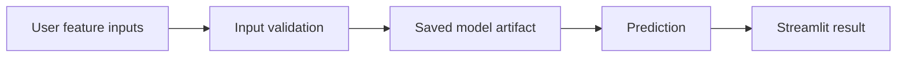

# ML Project Live


This repository collects early machine-learning portfolio work, including a diabetes prediction Streamlit app and exploratory notebooks for house-price and credit-card fraud prediction.

## Main Application

The primary runnable project is:

```text
DIABETES_PREDICT_webapp.py
```

It loads the saved model artifact from `models/trained_model.sav`, accepts patient feature inputs, and returns a diabetes-risk classification.

## Important Disclaimer

This is an educational machine-learning demo. It is not medical advice and must not be used for clinical diagnosis, treatment, or patient decision-making.

## Improvements Included

- Removed hard-coded local Windows paths.
- Added model loading from the repository directory.
- Replaced free-text inputs with numeric inputs and ranges.
- Added Streamlit model caching.
- Added prediction error handling.
- Added a CLI-friendly prediction script.
- Added setup documentation, dependency file, and `.gitignore`.
- Split reusable prediction logic into `src/diabetes_predictor`.
- Added pytest coverage and GitHub Actions CI.

## Architecture



## Project Structure

```text
ML_PROJECT_LIVE/
|-- DIABETES_PREDICT_webapp.py       # Streamlit entrypoint
|-- DIABETES_PREDICTION_SYSTEM.py    # CLI smoke-test entrypoint
|-- requirements.txt
|-- README.md
|-- .gitignore
|-- models/
|   `-- trained_model.sav
|-- notebooks/
|   |-- house_price_prediction.ipynb
|   `-- credit_card_fraud_detection.ipynb
|-- src/
|   `-- diabetes_predictor/
|       |-- app.py                   # UI orchestration
|       |-- config.py                # model path and feature ranges
|       `-- predictor.py             # validation and prediction logic
|-- tests/
|   `-- test_predictor.py
`-- .github/workflows/ci.yml
```

## Quick Start

```bash
python -m venv .venv
.venv\\Scripts\\activate
pip install -r requirements.txt
streamlit run DIABETES_PREDICT_webapp.py
```

On macOS/Linux:

```bash
source .venv/bin/activate
```

## CLI Smoke Test

```bash
python DIABETES_PREDICTION_SYSTEM.py
```

## Development Workflow

```bash
set PYTHONPATH=src
pytest -q
python -m compileall DIABETES_PREDICT_webapp.py DIABETES_PREDICTION_SYSTEM.py src
```

On macOS/Linux:

```bash
export PYTHONPATH=src
```

## Features Used by the Model

```text
Pregnancies, Glucose, Blood Pressure, Skin Thickness, Insulin,
BMI, Diabetes Pedigree Function, Age
```

## Security and Reliability Notes

- The app uses a committed pickle model artifact. Only load pickle files from trusted sources.
- For production, retrain and export the model with a documented pipeline, model card, and reproducible dataset.
- Add input distribution checks before using the model outside portfolio demonstrations.

## Roadmap

- Add model training notebook cleanup and metrics summary
- Add model card with dataset source, score, limitations, and bias risks
- Add model drift and input distribution checks
- Replace pickle artifact with a safer model packaging format where possible

## License

No license file is currently included. Add a license before reusing or distributing this project.
